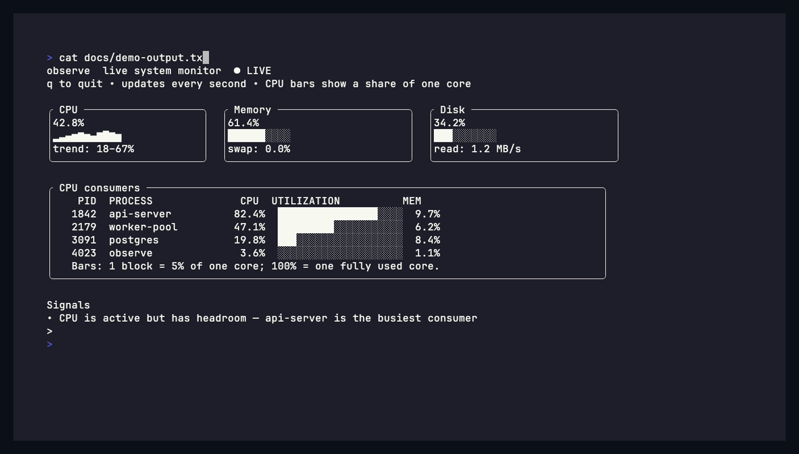

# observe

[](https://github.com/pol-cova/observe/actions/workflows/ci.yml)
[](https://github.com/pol-cova/observe/releases/latest)
[](go.mod)
[](LICENSE)

`observe` is a live, zero-config monitoring cockpit for a single machine. It turns the signals your operating system already exposes into one fast, readable terminal view: CPU pressure, memory and disk use, network throughput and errors, listening ports, and the processes doing the work.

Use it to answer *what is this machine doing right now?* while debugging a slow app, watching a development server, investigating a production box, or running a workload. It highlights likely bottlenecks instead of making you assemble a dashboard first.



Prometheus and load-test commands are optional integrations when you need application metrics or want to correlate a workload with system health.

## Install

Download an archive from [Releases](https://github.com/pol-cova/observe/releases), or install the latest development version with Go:

```bash
brew install pol-cova/homebrew-tap/observe

# Or install the latest development version with Go.
go install github.com/pol-cova/observe@latest
```

## Use

```bash
# Monitor this machine.
observe

# Discover metrics from Prometheus.
observe --prometheus http://localhost:9090

# Run any workload command alongside live system telemetry.
observe --load "k6 run test.js"

# Scan the machine for common services and listening ports.
observe init

# Get a concise diagnosis from the current local snapshot.
observe ask "is my server CPU bound?"
```

Press `q` to leave the dashboard.

## What it shows

- CPU, memory, disk, network throughput, network errors, and listening TCP ports.
- The processes using the most CPU.
- Practical warnings for saturated CPU, high memory use, a nearly full disk, and network errors.
- A simple setup scan for locally running services and common tooling.

## How it works

`observe` runs locally and samples the machine once per second with `gopsutil`. It keeps a short history for the animated CPU sparkline, ranks local processes by CPU use, and turns threshold crossings into plain-language signals. It does not require an account, agent, database, or configuration file, and it does not send your system metrics anywhere.

## Optional integrations

- **Prometheus:** discover available metric names and browse ready-to-use PromQL presets with `observe presets`.
- **Workload commands:** run a command in the background and view its recent output alongside system telemetry. `k6`, `wrk`, `hey`, and `oha` output is parsed for common request-rate, latency, and error-rate values.

## Development

Requires Go 1.23 or later.

```bash
git clone https://github.com/pol-cova/observe.git
cd observe
go test ./...
go run .
```

CI runs `go vet`, tests, and a production build on every pull request and push to `main`.

## Contributing

Contributions are welcome. Please read [CONTRIBUTING.md](CONTRIBUTING.md), follow the [Code of Conduct](CODE_OF_CONDUCT.md), and report security issues according to [SECURITY.md](SECURITY.md).

## License

MIT. See [LICENSE](LICENSE).
